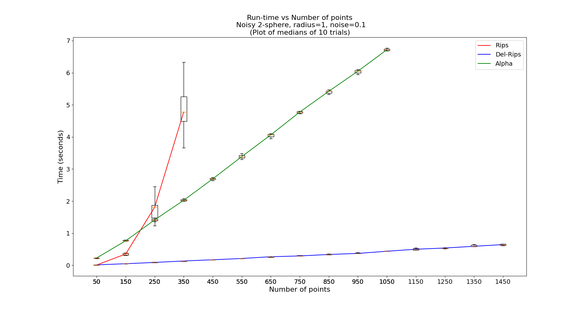

[](https://badge.fury.io/py/cechmate)
[](https://pypi.python.org/pypi/cechmate/)
[](https://travis-ci.org/scikit-tda/cechmate)
[](https://codecov.io/gh/scikit-tda/cechmate)
[](https://opensource.org/licenses/MIT)

# Personal Fork
This forked repo has the added **Delaunay-Rips (DR) filtration** method I have been working on for research at Florida Atlantic University. Essentially, the DR filtration has simplices found in the Delaunay Triangulation of the point cloud with the Vietoris-Rips weights on the simplices. My code is written in the file
`cechmate-DR/cechmate/filtrations/del_rips.py`

The method can be imported into a python file from this library by typing
`from cechmate import DR`

Our goal is to showcase the computational efficiency and practical usage of Delaunay-Rips when compared to other methods such as Rips and Alpha. Here is a graph illustrating the speed-up experienced using Delaunay-Rips




---------------------------------------------------

This library provides easy to use constructors for custom filtrations that are suitable for use with [Phat](https://github.com/xoltar/phat). 
Phat currently provides a clean interface for persistence reduction algorithms for boundary matrices. 
This tool helps bridge the gap between data and boundary matrices.  
Currently, we support construction of Alpha, Rips, and Cech filtrations, and provide an easy interface for Phat.

If you have a particular filtration you would like implemented, please feel free to reach out and we can work on helping with implementation and integration, so others can use it.

# Setup

We use the following dependencies in this library

* Numpy
* Scipy
* Matplotlib
* Phat


The latest version of Cechmate can be found on Pypi and installed with pip:

```
pip install cechmate
```

# Contributions


We welcome contributions of all shapes and sizes. There are lots of opportunities for potential projects, so please get in touch if you would like to help out. Everything from an implementation of your favorite distance, notebooks, examples, and documentation are all equally valuable so please don't feel you can't contribute. 

To contribute please fork the project make your changes and submit a pull request. We will do our best to work through any issues with you and get your code merged into the main branch.


## Documentation

Check out complete documentation at [cechmate.scikit-tda.org](https://cechmate.scikit-tda.org/)
